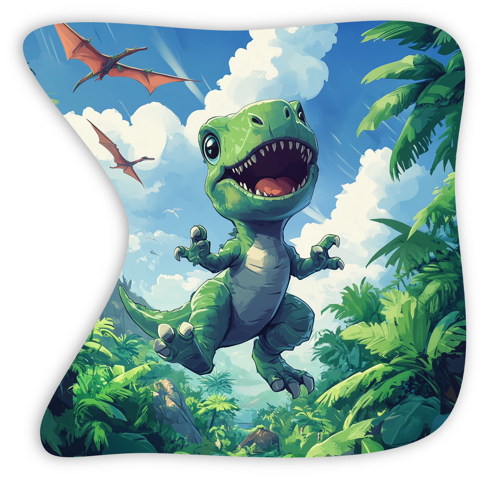
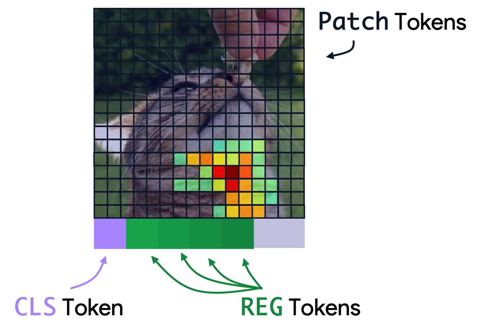

<p align="center">
  <a href="https://fel-thomas.github.io/dinovision/">
    
  </a>
</p>

### <b>Dino</b>Vision

<b>Dino</b>Vision provides an interactive interface to explore 32,000 concept vectors. Each point represents a concept learned by sparse autoencoders. Click here to explore **[Launch DinoVision →](https://fel-thomas.github.io/dinovision/)**

## Getting Started

<div align="right">
  
</div>

[DINOv2 (+ registers)](https://arxiv.org/html/2309.16588v2) processes images by dividing them into patch tokens. Each image is split into 256 spatial patches arranged in a 16×16 grid, plus 1 CLS (classification) token for global features and 4 register (REG) tokens for auxiliary processing - totaling 261 tokens. The demo showcase a series of concepts (as a first approximation, you can think of concept as a linear direction available to any downstream task) and we provide token maps to help understand them: the more a concept fires on a patch token, the redder it appears. The same applies to CLS and REG tokens, which we display below the spatial grid (some concepts actually fire exclusively on CLS or REG tokens).

Concerning the 2D UMAP projection, it displays over 32,000 concept vectors extracted from DINOv2 using  [RA-SAE (Archetypal SAE)](https://arxiv.org/abs/2502.12892). Each point represents a concept - a learned direction in the high-dimensional embedding space that captures specific visual patterns.

**Key Visual Elements:**

- **Point size**: Larger points indicate concepts with higher activation energy that fire more frequently across images
- **Point color**: Represents different concept clusters or properties (customizable via controls)
- **Connecting lines**: Show concepts that regularly co-occur together during image processing
- **Spatial proximity**: Points close together represent similar concepts (UMAP preserves local neighborhood structure)

**Navigation:**
- **Click any point** to explore that concept's activation patterns and example images
- **Specific ID field**: Enter a concept number to jump directly to it
- **Distance slider**: Adjust the minimum distance between points in the visualization
- **Size slider**: Control the overall point size scaling
- **Heatmap opacity**: Modify the transparency of activation overlays

**Analysis Features:**
- **Example images**: See real image patches where concepts fire most strongly
- **Co-occurrence tab**: Examine which concepts activate together frequently


## Technical Details

The demo is built with Vue 3, D3.js, and Vuetify. It uses Canvas rendering for performance as we have quite a large set of points: the visualization supports real-time interaction with 32,000+ data points.
The visualization expects a JSON file with the following structure:

```
{
  "umap_x": [float, ...],                    // UMAP x-coordinates for concepts
  "umap_y": [float, ...],                    // UMAP y-coordinates for concepts
  "umap_colors": [[r, g, b], ...],           // RGB color values (0-1 range)
  "umap_scale": [float, ...],                // Scale multipliers for point sizes
  "energy": [float, ...],                    // Activation energy values
  "is_dead": [0 or 1, ...],                  // Binary flags for active/inactive concepts
  "connections_idx": [[int, ...], ...],      // Connected concept IDs
  "connections_val": [[float, ...], ...],    // Connection strength values
  "nb_fire": [int, ...]                      // Activation frequency counts
}
```

# 👏 Credits
<div align="right">
  <picture>
    <source srcset="https://kempnerinstitute.harvard.edu/app/uploads/2024/08/Kempner-logo_Full-Color-Kempner-and-Harvard-Logo-Lockup-2048x552.png"  width="60%" align="right">
    
  </picture>
</div>

This work has been made possible in part by the generous support provided by the Kempner Institute at Harvard University. The institute, established through a gift from the Chan Zuckerberg Initiative Foundation, is dedicated to advancing research in natural and artificial intelligence. The resources and commitment of the Kempner Institute have been instrumental in the development and completion of this project.


## Citation

If you use **Dino**Vision in your research, please cite:

```bibtex
@article{fel2024rabbit,
  title={Into the Rabbit Hull: From Task-Relevant Concepts in DINO to Minkowski Geometry},
  author={Fel, Thomas and Wang, Binxu and Lepori, Mikey and Kowal, Matt and Lee, Andrew and Balestriero, Randall and Joseph, Sonia and Konkle, Talia and Ba, Demba and Wattenberg, Martin},
  journal={arXiv preprint},
  year={2025}
}